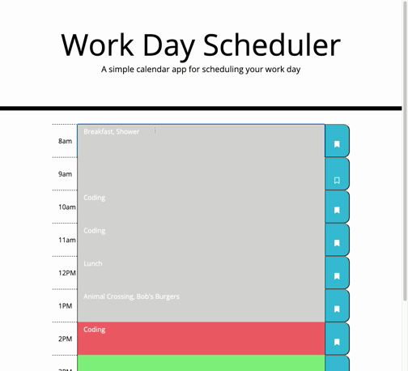

# Code Quiz
This web application allows users to plan their workday. The planner features hour blocks for each hour between 8am and 6pm, and users can enter events into and save each hour separately. The hour blocks are styled with an easy visual representation of past hours (grey), the current hour (red), and future hours (green).

To make for a clearer user interface, unsaved event text appears grey, and the save button icon toggles between an outlined (unsaved) and solid bookmark (saved) to help the user know what they've saved, and what changes would be lost in a page refresh.

[View the deployed web application.](https://dandandanoneil.github.io/day-planner/index.html)

## Screenshot

*Animated screenshot of a user changing the 8am block from "Breakfast, Shower" to "Breakfast, Shower, Animal Crossing", then clicking the save button.*

> Written with [StackEdit](https://stackedit.io/).